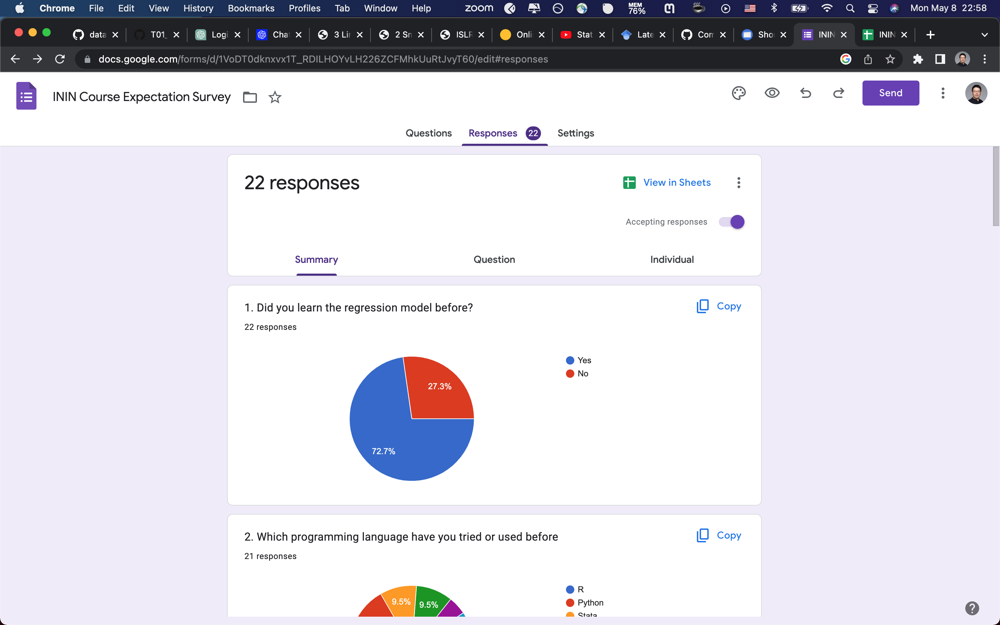

# Institutions and Innovation

## Tutorial 01 - Statistics Review

Prof. Dr. Cornelia Storz
Fei Wang (Michael) :heart: AI
Goehte University Frankfurt
Summer Semester 2023


---

# Roadmap of this tutorial

#### 1.  [Introduction to `data.table`](#1-introduction-to-datatable)
#### 2.  [Univariate Statistics](#2-univariate-statistics)
#### 3.  [Bivariate Statistics](#3-bivariate-statistics)
#### 4.  [Multivariate Statistics](#4-multivariate-statistics)
#### 5.  [Regression Analysis](#5-regression-analysis)
#### 6.  [Summary](#6-summary)


---

# 1. Introduction to `data.table` 


---

# 1.1. What is `data.table`?

- `data.table` is a package in R that provides an enhanced version of data.frame. It is widely used for fast aggregation of large datasets, low latency add/update/remove of columns, quicker ordered joins, and a fast file reader. `data.table` is an extension of `data.frame` package in R. 
- check benchmark: https://h2oai.github.io/db-benchmark/
    - 100 GB data
    - 155 seconds
    - out of memory for `Pandas`


---

# In-class Lab 1.1 :butterfly:


---

# In-class Lab 1.1 :butterfly:




---

# In-class Lab 1.1 :butterfly:

```r
# library
library(data.table)

# read the dataset from url
# url: https://shorturl.at/eixVX
csv_url <- "https://shorturl.at/eixVX"
survey <- fread(csv_url)

# check the data
str(survey)
head(survey)
summary(survey)
```


---

# 2. Univariate Statistics


--- 

# 2.1. What is Univariate Statistics?

- Univariate analysis is the simplest form of analyzing data. <mark>“Uni” means “one”</mark>, so in other words your data has only one variable. It doesn’t deal with causes or relationships (unlike regression) and it’s major purpose is to describe; It takes data, summarizes that data and finds patterns in the data.

- Methods:
    - Discrete data: frequency table, bar chart, pie chart
    - Continuous data: histogram, box plot, summary statistics


---

# 2.2. Discrete Data


<div class="columns">
<div>

For discrete data, we can use 
- frequency table
- bar chart
- pie chart to visualize the data.


</div>
<div>

|q1  |  N|
|:---|--:|
|no  |  6|
|yes | 16|

</div>
</div>

--- 


# 2.2.1. Bar plot


```r
# use basic R function to get the frequency table
survey %>%
    with(table(q1)) %>%
    kable()

# using prop.table function to get the percentage
survey %>%
    with(table(q1)) %>%
    prop.table() %>%
    kable()

options(repr.plot.width = 8, repr.plot.height = 5)
survey %>%
    with(table(q1)) %>%
    barplot(main = "Did you study the regression analysis before?",
            xlab = "Answer",
            ylab = "Count",
            col = "lightblue")
```


--- 

# 2.2.2. Binomial Distribution

- Binomial distribution is a discrete probability distribution that expresses the probability of one set of two outcomes, as a function of the number of trials.

- In our survey, 70% of the students have studied the regression analysis before. We can use binomial distribution to calculate the probability of the number of students who have studied the regression analysis before.

- One class has 100 students. What is the probability that 30 of them have studied the regression analysis before?


---

# 2.2.2. Binomial Distribution

- `dbinom(x, size, prob)` is the function to calculate the probability of x successes in size trials with the probability of success prob.

- `pbinom(x, size, prob)` is the function to calculate the cumulative probability of x successes in size trials with the probability of success prob.

```r
# probability of 30 students have studied the regression analysis before
dbinom(30, 100, 0.7)  # discrete probability
pbinom(30, 100, 0.7)  # cumulative probability
```

- The formula of binomial distribution is:

$$
P(X=k) = \binom{n}{k}p^k(1-p)^{n-k}
$$

--- 

# 2.2.2. Binomial Distribution (discrete probability)


--- 

# 2.2.2. Binomial Distribution (discrete probability)

- Properties of binomial distribution:
    - The mean of binomial distribution is $np$.
    - The variance of binomial distribution is $np(1-p)$.
    - The standard deviation of binomial distribution is $\sqrt{np(1-p)}$.

- For instance, the mean of the number of students who have studied the regression analysis before is $100 \times 0.7 = 70$.


--- 

# 2.2.2. From Binomial Distribution to Poisson Distribution

> Now, suppose you are a restaurant owner. You want to know how many customers will come to your restaurant from 10am to 11am. How could you estimate the number of customers?

&nbsp;


--- 

# 2.2.2. From Binomial Distribution to Poisson Distribution

> Now, suppose you are a restaurant owner. You want to know how many customers will come to your restaurant from 10am to 11am. How could you estimate the number of customers?

1. Do a survey?
    - fixed time and space
2. Use the competitor's data?
    - different restaurant
    - fixed time and people


--- 

# 2.2.2. From Binomial Distribution to Poisson Distribution

> Now, suppose you are a restaurant owner. You want to know how many customers will come to your restaurant from 10am to 11am. How could you estimate the number of customers?

- Our univariate dimension:
    - time: 10am to 11am
    - space: the restaurant
    - people: customers
    - event: customers come to the restaurant


---

# 3. Bivariate Statistics


---

# 4. Multivariate Statistics


---

# 5. Regression Analysis


---

# 6. Summary

